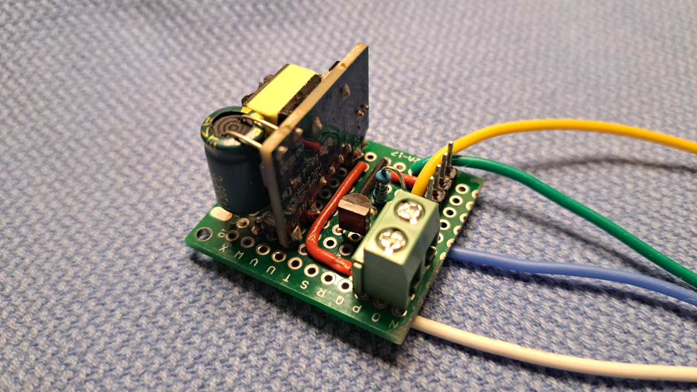
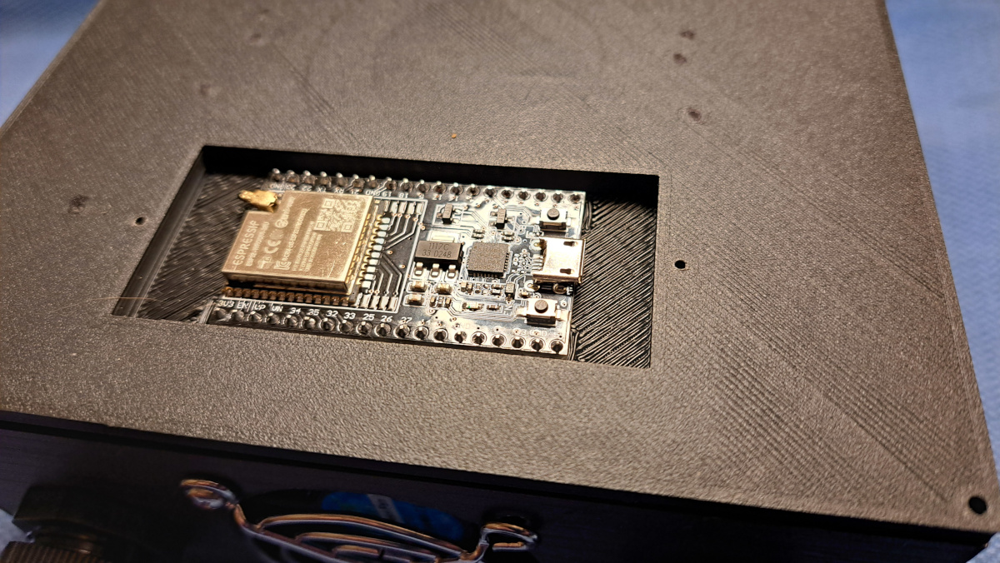
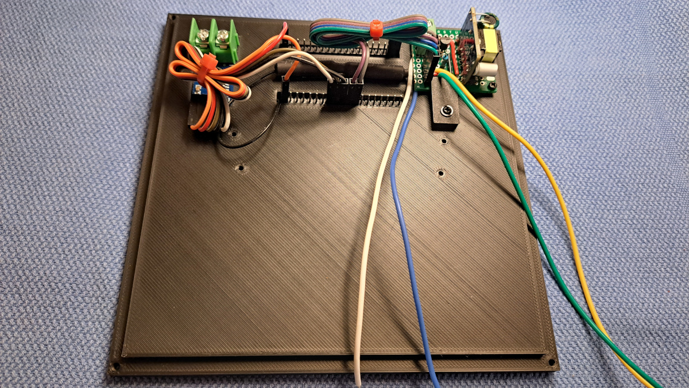
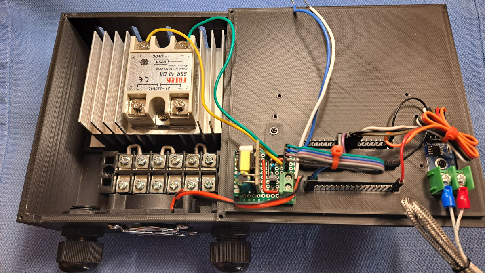
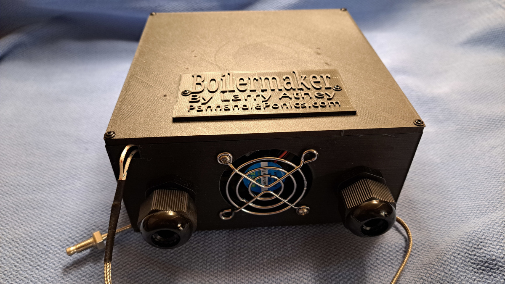

If you are just going to be using this with a small still (1000 watts or less) and a DS18B20 temperature sensor, you can simply use the [PSU and Interface](https://github.com/larry-athey/airhead/tree/main/Diagrams) schematic and PCB for the Airhead project. You can also directly drive a 3.3 volt 50mm fan from the GPIO port if you feel that you want to add a fan to it. A 1000 watt load really won't warm up the SSR heat sink that much.

However, if you're going to be running something heftier than that or you intend to use a Type-K thermocouple and a MAX-6675 amplifier, you'll want to follow the schematic that I've provided here. There's a whole lot of nothing complicated going on with it. Everything is just a few point-to-point connections and a simple transistor switch to run a 5 volt cooling fan.

I don't have any plans to create a PCB for this PSU and interface due to the fact that I could easily build a couple dozen of them at a relaxed pace just using point-to-point prototype boards, as I wait for the 3D printing of the case to finish. As you can see by looking at **PSU-and-Interface.jpg**, there's a whole lot of nothing involved in making these on a small piece of prototype PCB.

 

As you can see, there's a whole lot of nothing to it. 4 wires come from it for the SSR + _(yellow)_, SSR - _(green)_, and two for the AC power input to the power supply _(blue and white)_. The cooling fan connects to the screw terminals +(+ on the left, - on the right)_. The 4-pin header is for the ESP32 for _(left to right)_ the fan trigger, SSR trigger, +5 volts, and ground. This only takes about an hour to assemble.

 

As you can see in the **ESP32-Home.jpg** photo in the above, the ESP32 simply rests in the recessed cavity in the case cover. Another cover goes over this _(the **BM-ESP32-Cover.stl** model)_ to keep the ESP32 in place. This cavity is also big enough to hold the LilyGo ABS shell for their standard non-touch T-Display-S3 module. I've used a 38 pin WROOM-DA in this photo with an external antenna.

 

In the **Case-Cover-Assembled.jpg** photo shown above, you can see the placement of the PSU and interface board, the MAX-6675 thermocouple amplifier, and the ribbon cables used to connect everything to the ESP32 pins. The external antenna is located between the rows of the ESP32 pins. If you bundle up the ribbon cables with zip ties, this will keep everything out of the way of the heatsink.

 

In the **Case-Bottom-Assembled.jpg** photo shown above, you can see the SSR and heatink as well as a screw terminal bus bar installed in the case bottom. The trigger wires to the SSR are connected and you would connect your AC power input/output lines at this point. Connect the ESP32 PSU input lines to the AC input side of the SSR and the bus bar. Honestly, it's totally up to you if you want to switch the AC hot or neutral line with the SSR, it honestly makes no difference. Connect the fan & thermocouple and you're done.

 

And, as you can see in the **Assembled-Boilermaker.jpg** photo above, you have an assembled Boilermaker that's ready to go. Your choice of SSR will vary, depending on the load that you intend to run. Refer to the last paragraph in the [Usage Tips](https://github.com/larry-athey/boilermaker/blob/main/Instructions/Usage-Tips.md) document for more information. While the amperage rating is important, the size of the heatink and having a cooling fan are equally important. You can very easily blow an SSR-100DA with a mere 1500 watt load if you don't keep it cool.
